<div align="center">

# 🌱 Plant Counselor

**An AI gardener that grows your worries, goals, and schedules like plants**

<!-- TODO: license badge — add once a LICENSE file is chosen -->
[](https://www.python.org/)
[](https://fastapi.tiangolo.com/)
[](https://www.typescriptlang.org/)
[](https://nextjs.org/)
[](https://www.postgresql.org/)
[](https://docs.docker.com/compose/)

**English** | [한국어](./README.ko.md)


</div>

---

## 💭 Developer's Note

> *"Every worry starts as a bud. Whether it flowers or wilts depends on whether you tend to it."*

<!-- TODO: 개발 동기 -->

---

## ✨ Features

### 🌿 Plants and Buds
- A **plant** is an area of life (job hunting, health, study); a **bud** is a concrete worry, goal, or tracked schedule inside it
- Buds move through `bud → flower → fruit → harvested`; progress of 60% turns a bud into a flower and 85% into a fruit
- Harvesting is only allowed at 100% progress — the rule lives in the service layer, so the AI cannot bypass it either
- Each status change is written to a history table and shown in the bud detail drawer

### 🥀 Wilting and Rot
- An APScheduler job scans every 10 minutes and marks buds with no progress as `wilting`, then `rot`
- Thresholds come from each user's garden rules (defaults: wilt after 7 days, rot after 14, deadline warning 3 days before)
- Wilting, rot, and upcoming deadlines create notifications; duplicate unread deadline warnings are skipped

### 🤖 AI Gardener
- Natural-language requests go through a Gemini ReAct loop (up to 10 steps) that can call 20 skills such as `create_bud`, `update_bud_progress`, and `create_calendar_event`
- Responses stream over SSE (`start`, `tool_call`, `tool_result`, `token`, `done`)
- Chat has four scopes (global, plant, bud, calendar); edits and deletes outside the current scope are blocked on the server
- Each user brings their own Gemini API key; it is kept in the browser and sent per request, never stored on the server

### 🖼️ Pixel-Art Garden
- Plants are drawn as pixel-art sprites whose flowers, fruit, and color reflect their buds' states
- The garden view supports zoom, and harvested buds collect in a harvest basket
- A list view is available for the same data

### 📅 Calendar
- Bud deadlines and standalone events are merged into one month view
- Events support start/end time, all-day, multi-day ranges, repeat rules (daily to yearly), and six colors
- Overlapping times are saved but reported as conflicts; events can be dragged to another day
- Data can be exported as JSON, CSV, or ICS

### 🗂️ Conversation History
- Conversations are stored per scope and can be browsed and searched on the history page
- Chat and history share one Markdown renderer with `javascript:`/`data:` links blocked

### 🛠️ Admin Console
- User and role management, per-user AI model override, and an AI log viewer (prompts, LLM calls, skill calls, errors)
- Notification broadcast, ZIP backup and non-overwriting restore, runtime settings, and a SQL console
- A time-travel offset shifts the app clock to test wilting and deadline rules

---

## 🚀 Getting Started

### Prerequisites
- [Docker](https://docs.docker.com/get-docker/) with Docker Compose
- (For AI chat only) a [Google Gemini API key](https://aistudio.google.com/apikey)

### Run

```bash
git clone https://github.com/Zanviq/Plant-Counselor.git
cd Plant-Counselor
cp .env.example .env
docker compose up --build
```

- Web app: http://localhost:3000
- API docs: http://localhost:8000/docs

On first start the backend applies the Alembic migrations and inserts demo data.

### Demo Accounts

| Role | ID | Password |
|------|----|----------|
| User | `demo` | `demo1234` |
| Admin | `admin` | `admin1234` |

### Gemini API Key

Everything except the AI chat works without a key. To use the AI gardener:

1. Open **Settings → AI** (or open the AI panel and use the key box shown there)
2. Paste your key from [Google AI Studio](https://aistudio.google.com/apikey) and press **Save**
3. The key is stored in this browser's `localStorage` and sent as the `X-Gemini-Api-Key` header on chat requests only

---

## 🛠️ Tech Stack

| Category | Technology |
|----------|------------|
| **Frontend** | Next.js 16 (App Router), React 19, TypeScript |
| **State** | TanStack Query v5, Zustand |
| **Styling** | Tailwind CSS v4, CSS variables (light/dark) |
| **Backend** | FastAPI, Pydantic v2, APScheduler |
| **Database** | PostgreSQL 16, psycopg 3, Alembic |
| **Auth** | bcrypt password hashes, HS256 JWT in an httpOnly cookie |
| **AI** | Google Gemini (`google-genai`) |
| **Infra** | Docker Compose (multi-stage images) |

---

## 📁 Project Structure

```
plant-counselor/
├── 📂 backend/
│   ├── 📂 alembic/versions/     # SQL migrations (schema baseline)
│   ├── 📂 app/
│   │   ├── 📂 ai/               # ReAct orchestrator, Gemini client, prompt, permissions
│   │   │   └── 📂 skills/       # 20 AI skills
│   │   ├── 📂 db/
│   │   │   ├── pg.py            # psycopg query builder and connection pool
│   │   │   └── seed.py          # demo accounts and sample data
│   │   ├── 📂 repositories/     # SQL access, always filtered by user_id
│   │   ├── 📂 routers/          # auth, plants, buds, calendar, chat, admin ...
│   │   ├── 📂 services/         # lifecycle rules, calendar, backup, transitions
│   │   ├── 📂 scheduler/        # wilting / rot / deadline scan job
│   │   ├── security.py          # bcrypt + session cookie
│   │   └── main.py              # FastAPI app and CORS wrapper
│   ├── docker-entrypoint.sh     # migrate → seed → start
│   └── Dockerfile
├── 📂 frontend/
│   ├── 📂 app/
│   │   ├── 📂 (app)/            # home, plants, calendar, history, settings
│   │   ├── 📂 (auth)/login/     # login and sign-up
│   │   └── 📂 admin/            # admin console
│   ├── 📂 components/           # chat panel, garden sprites, sidebar
│   ├── 📂 lib/
│   │   ├── 📂 api/              # API client and SSE stream reader
│   │   ├── geminiKey.ts         # browser-only Gemini key storage
│   │   └── markdown.tsx         # shared Markdown renderer
│   └── Dockerfile
├── 📂 scripts/capture-screenshots/  # Playwright script for README images
├── 📂 image/                    # screenshots
├── docker-compose.yml
└── .env.example
```

---

## 💡 How to Use

1. **Log in**: Sign in with `demo / demo1234` or create an account on the sign-up tab
2. **Check the dashboard**: Home shows active worries, schedules, harvests this month, and buds that need attention
3. **Ask the AI gardener**: Press the AI button (or Space) and type something like "Add a bud for 'portfolio' to job hunting, due next Friday"
4. **Update progress**: Open a bud in a plant's detail page and drag the progress slider; harvest it at 100%
5. **Plan on the calendar**: Add an event with **+ Add event**, or drag an event to another day
6. **Review history**: Open the history page to search past conversations by scope
7. **Adjust garden rules**: Change wilting and deadline thresholds in **Settings → Garden rules**

---

## 👥 Team

| Name | Role |
|------|------|
| confidencecat (Zanviq) | Project lead, overall development |
| studysnack | Frontend development, feature support |

---

## 🎨 Screenshots

<div align="center">

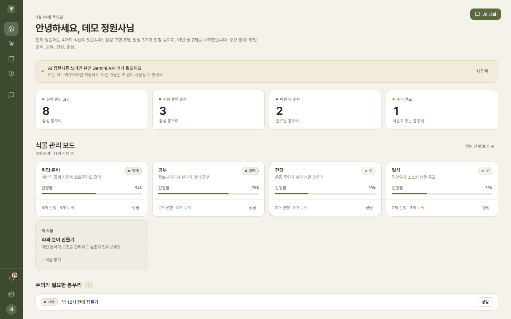

<table>
  <tr>
    <td>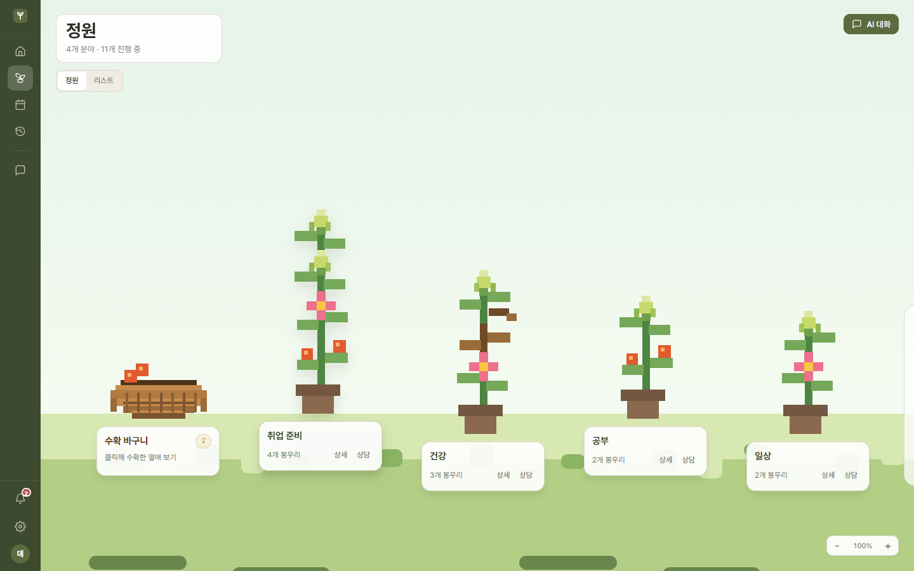</td>
    <td>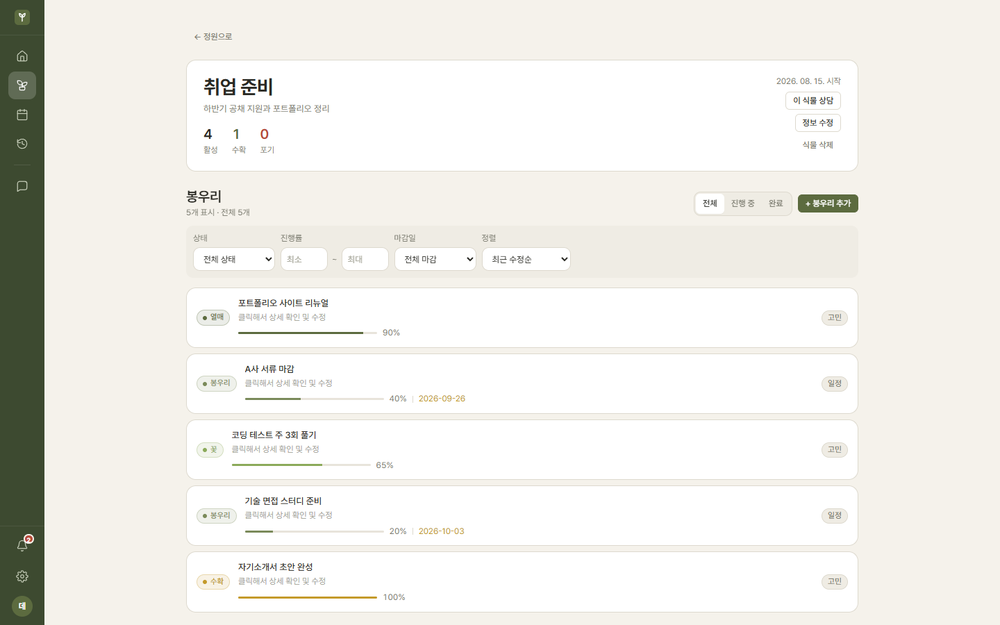</td>
  </tr>
  <tr>
    <td>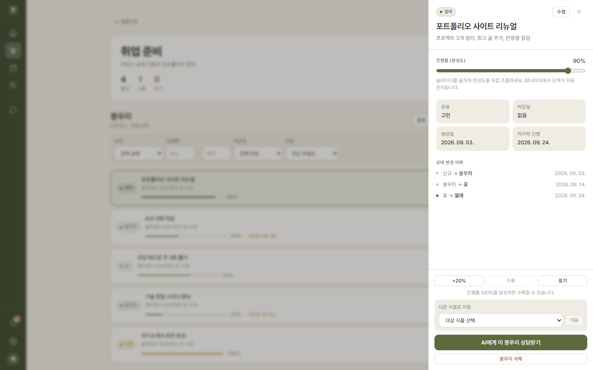</td>
    <td>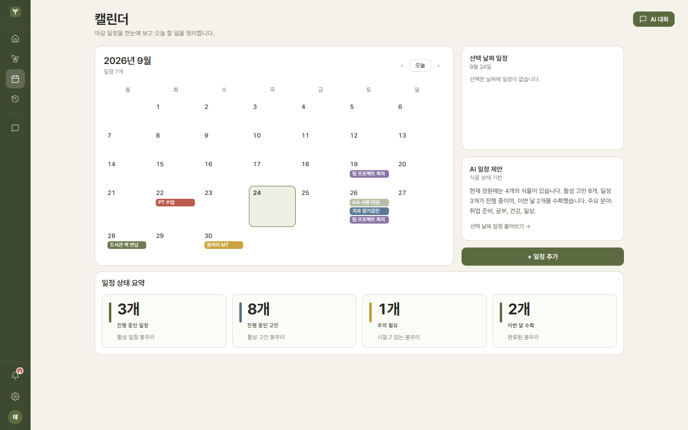</td>
  </tr>
  <tr>
    <td>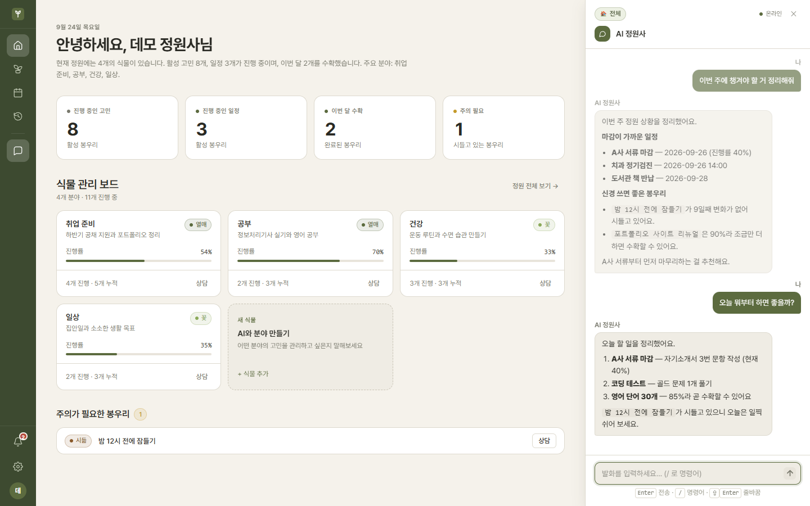</td>
    <td>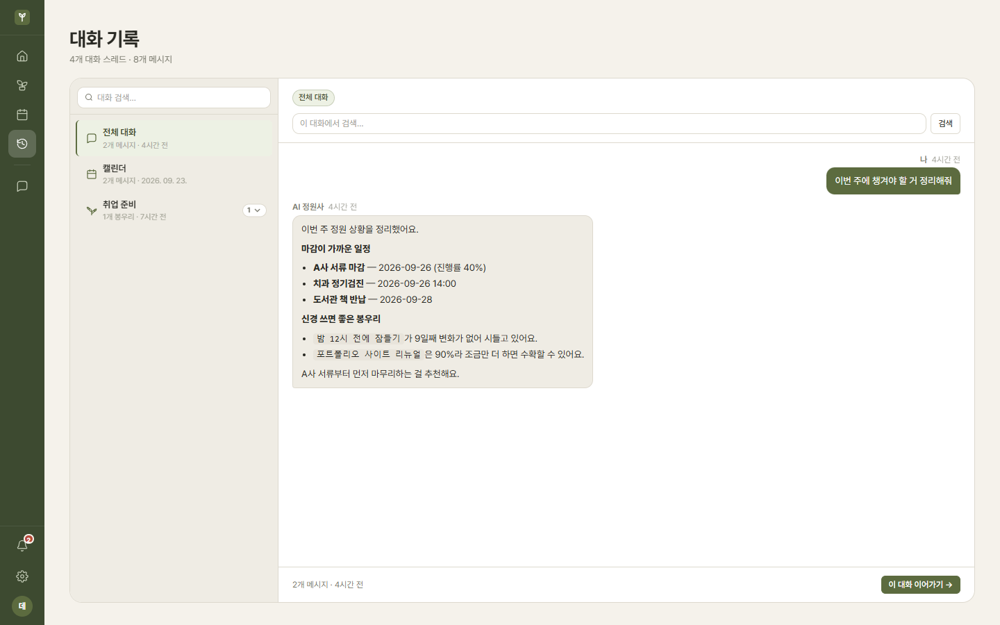</td>
  </tr>
  <tr>
    <td>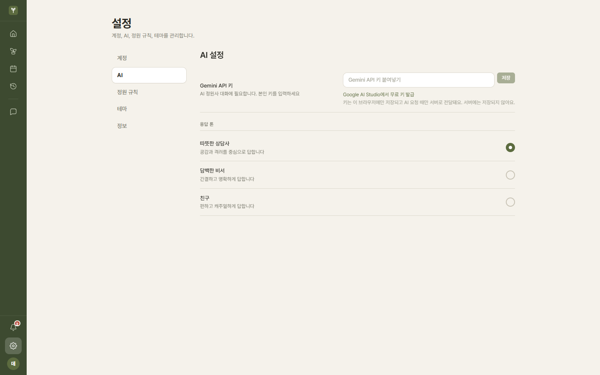</td>
    <td>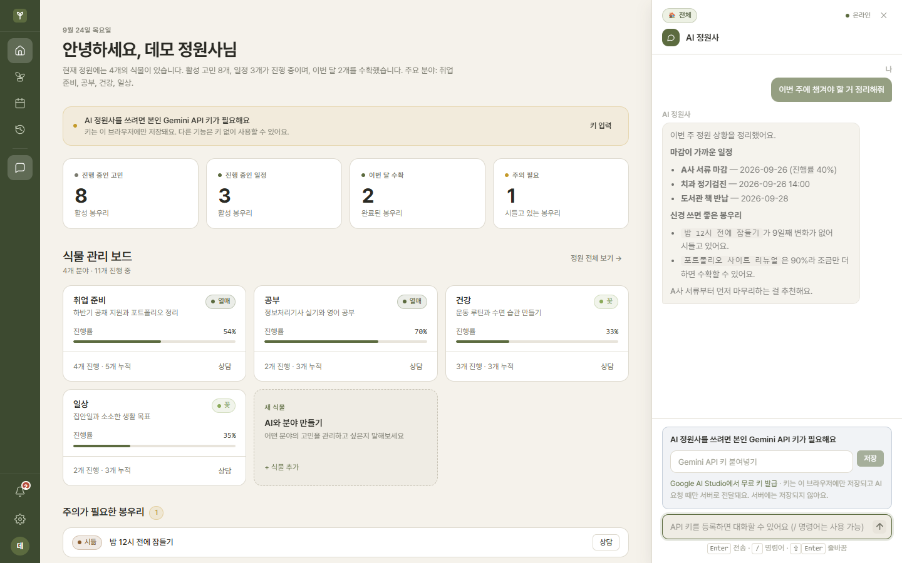</td>
  </tr>
  <tr>
    <td>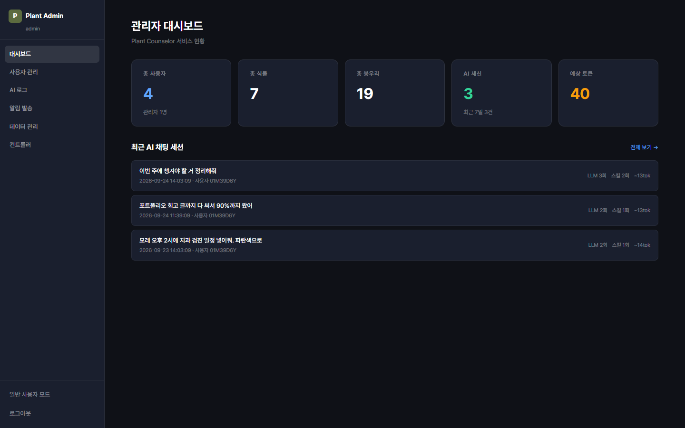</td>
    <td>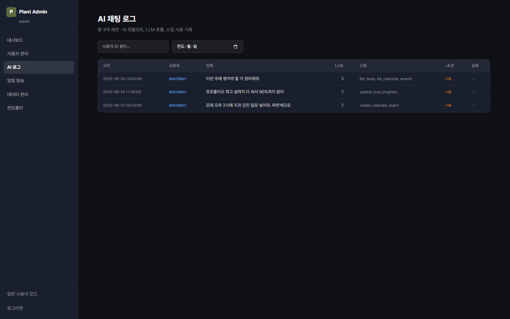</td>
  </tr>
  <tr>
    <td>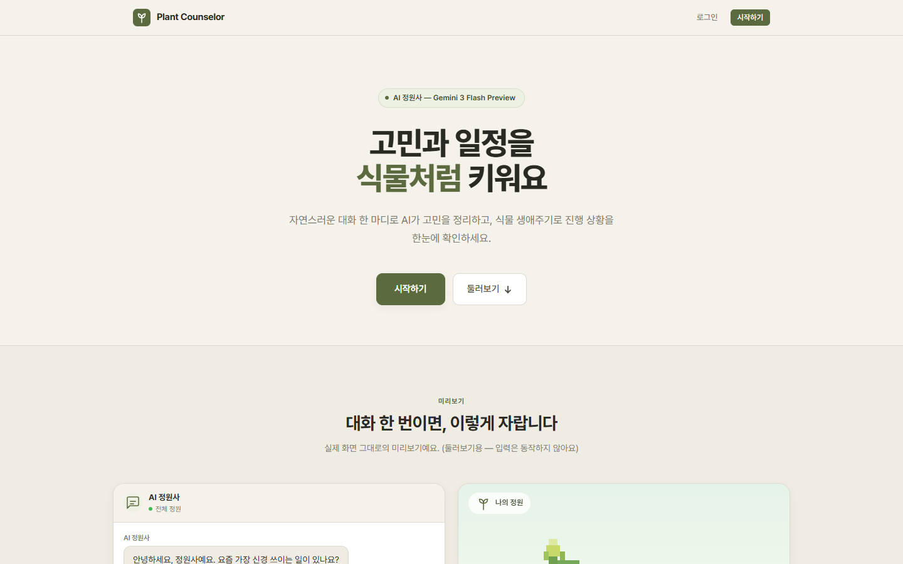</td>
    <td>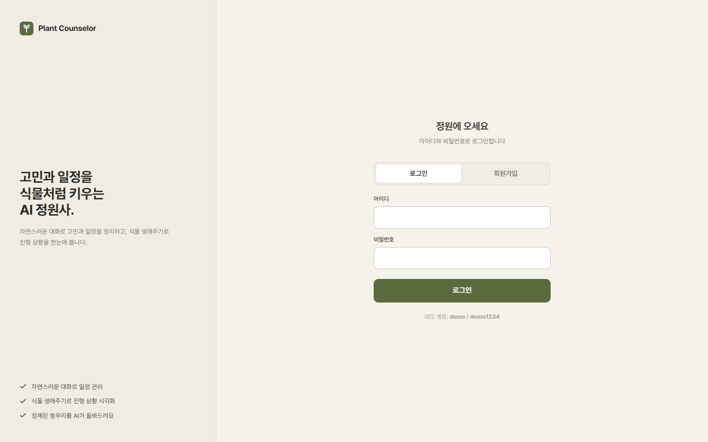</td>
  </tr>
</table>

<i>The AI chat screenshot uses a mocked response.</i>

</div>

---

## 📝 License

<!-- TODO: 라이선스 결정 후 LICENSE 파일 추가 및 문구 작성 -->

---

<div align="center">

| 👤 **Developer** | ✉️ **Email** |
|:---:|:---:|
| Zanviq | zanviq.dev@gmail.com |

</div>
